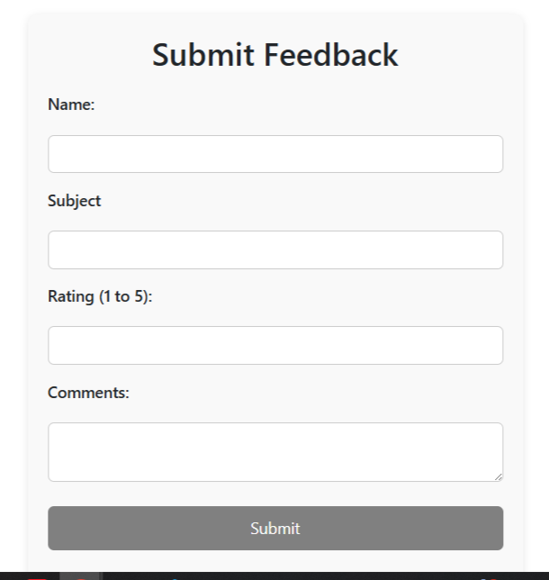

# 🎓 Student Feedback Portal

A simple and clean Angular 20 project that allows users (like students) to submit feedback and see a list of all feedbacks — built using **Standalone Components**, **Signals**, and **Reactive Forms**.

---

## 🌟 Features

- ✅ Submit feedback with name, subject, rating & comments
- ✅ List view of all feedbacks (auto-updated using Signals)
- ✅ Delete feedback entries
- ✅ Styled layout with responsive design
- ✅ Angular 20 using modern best practices

---

## 🚀 Tech Stack

- Angular 20 (Standalone Components)
- TypeScript
- SCSS
- Angular Signals
- Reactive Forms

---

## 📸 Screenshot

<!-- Add a real screenshot if available -->


---

## 🖥️ Live Demo

**👉 [Coming Soon - Live Link on Netlify or Vercel]**

---

## 🛠️ Getting Started

### 1. Clone the Repo

```bash
git clone https://github.com/YOUR_USERNAME/student-feedback.git
cd student-feedback
